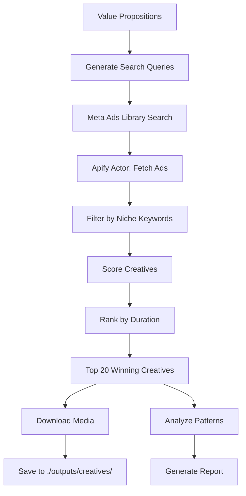

# Agent 3: Competitor Intel

## Purpose
Search and analyze competitor ad creatives in Meta Ads Library based on extracted value propositions.

## Workflow



## Winning Creative Criteria

| Metric | Threshold | Weight |
|--------|-----------|--------|
| **Days Active** | > 14 days | Primary |
| **Scale** | Multiple copies | Secondary |
| **Multi-Platform** | FB + IG + AN | Bonus |

## Search Query Generation

From value propositions, generate queries:
1. **Direct keywords**: Main offer terms
2. **Pain point keywords**: Problem language
3. **Competitor names**: If known
4. **Industry terms**: Niche-specific language

### Example VP → Queries
```
VP: "3-Day Workshop to Scale Your Agency with AI"

Queries:
- "Agency AI Workshop"
- "Scale Agency Automation"
- "AI Systems for Agencies"
- "Agency Owner Workshop"
```

## Apify Actor Configuration

```json
{
  "actorId": "curious_coder/facebook-ads-library-scraper",
  "input": {
    "urls": [
      "https://www.facebook.com/ads/library/?active_status=active&ad_type=all&country=US&q={QUERY}"
    ],
    "maxItems": 50
  }
}
```

> ⚠️ **Important**: Actor may ignore `maxItems`. Use `abort_all_runs.py` if needed.

## Post-Processing

### Filter Pipeline
1. **Active status**: Only currently running ads
2. **Duration filter**: Extract `start_date`, calculate days
3. **Niche filter**: Match content against industry keywords
4. **Limit**: Take top 20 by duration

### Creative Analysis
For each winning creative, extract:
- **Hook type**: Pain, curiosity, benefit, social proof, urgency
- **Offer type**: Lead magnet, discount, free trial, webinar
- **Visual style**: Minimalist, bold, testimonial, UGC
- **CTA type**: Learn more, sign up, get started, book call

## Output

### Directory Structure
```
outputs/
└── competitor_intel/
    ├── creatives/
    │   ├── ad_123456.jpg
    │   ├── ad_789012.mp4
    │   └── ...
    ├── report_[timestamp].md
    └── data_[timestamp].json
```

### Report Format
```markdown
# Competitor Intel Report
Date: [timestamp]
Queries: [list]

## Top Winning Creatives (20)
| Rank | Page | Days | Hook | Media |
|------|------|------|------|-------|
| 1 | Brand X | 45 | Pain | Image |
...

## Pattern Analysis
- Common hooks: [list]
- Color trends: [list]
- Format split: Image X%, Video Y%
```

## Output Schema
See: [competitor_intel.json](../shared/schemas/competitor_intel.json)

## MCP Tools Required
- `apify.run_actor` - Execute Meta Ads scraper
- `apify.get_dataset` - Retrieve results
