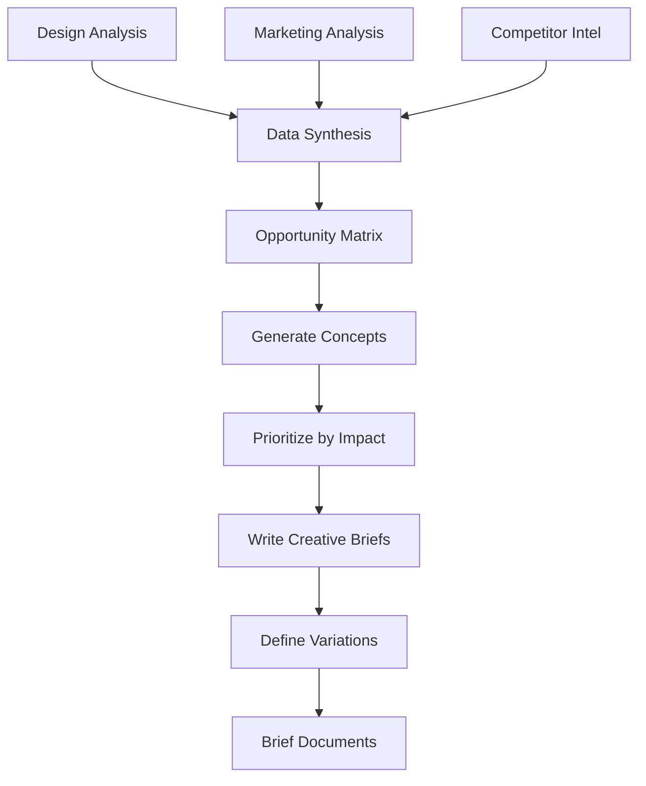

# Agent 4: Creative Strategist

## Purpose
Synthesize all collected data and generate detailed creative briefs for ad production.

## Inputs

| Source | Data |
|--------|------|
| Agent 1 | Funnel structure, brand assets, visual style |
| Agent 2 | Value propositions, audiences, offers |
| Agent 3 | Winning creatives, patterns, hooks |

## Workflow



## Opportunity Matrix

Cross-reference to find high-impact creative opportunities:

| Audience | Value Prop | Competitor Gap | Hook Type | Priority |
|----------|------------|----------------|-----------|----------|
| Segment A | VP 1 | Under-served | Pain | High |
| Segment B | VP 2 | Saturated | Benefit | Medium |
| ... | ... | ... | ... | ... |

## Concept Generation Rules

### 1. Hook Selection
Based on competitor analysis, choose hooks that:
- Work in the niche (proven by duration)
- Have room for differentiation
- Match audience psychological drivers

### 2. Visual Direction
Derived from:
- Brand assets (Agent 1)
- Winning creative styles (Agent 3)
- Format requirements (static 1:1, story 9:16)

### 3. Copy Framework
```
HOOK: [Attention grabber - 1 line]
BODY: [Problem → Solution → Proof - 2-3 lines]
CTA: [Clear action - 1 line]
```

## Brief Template

```json
{
  "id": "brief_001",
  "concept_name": "Pain Amplifier",
  "target_audience": "segment_a",
  "value_proposition": "vp_1",
  "format": "static",
  "dimensions": ["1080x1080", "1080x1920"],
  "creative_direction": {
    "hook": "Tired of [specific pain]?",
    "body": "Most [audience] struggle with [problem]. Our [mechanism] helps you [outcome] in [timeframe].",
    "cta": "Take the Quiz →",
    "visual_concept": "Split before/after layout",
    "color_scheme": ["#primary", "#accent"],
    "typography_style": "bold",
    "imagery": ["frustrated_person", "success_transformation"]
  },
  "variations": [
    {"variant": "A", "hook_variation": "Question format"},
    {"variant": "B", "hook_variation": "Statement format"},
    {"variant": "C", "hook_variation": "Stat format"}
  ],
  "reference_creatives": ["ad_123", "ad_456"],
  "priority": "high"
}
```

## Output Deliverables

1. **Brief JSON files**: Machine-readable for Agent 5
2. **Brief Summary**: Human-readable markdown
3. **Reference Board**: Compiled winning creative examples

### Directory Structure
```
outputs/
└── briefs/
    ├── brief_001.json
    ├── brief_002.json
    ├── summary.md
    └── references/
        ├── ref_ad_123.jpg
        └── ref_ad_456.jpg
```

## Output Schema
See: [creative_brief.json](../shared/schemas/creative_brief.json)

## Prioritization Criteria

| Factor | Weight | Scoring |
|--------|--------|---------|
| Audience size | 30% | Large = 3, Medium = 2, Small = 1 |
| Competitor gap | 25% | Untapped = 3, Some = 2, Saturated = 1 |
| Hook novelty | 25% | Novel = 3, Adapted = 2, Common = 1 |
| Brand fit | 20% | Perfect = 3, Good = 2, Stretch = 1 |
