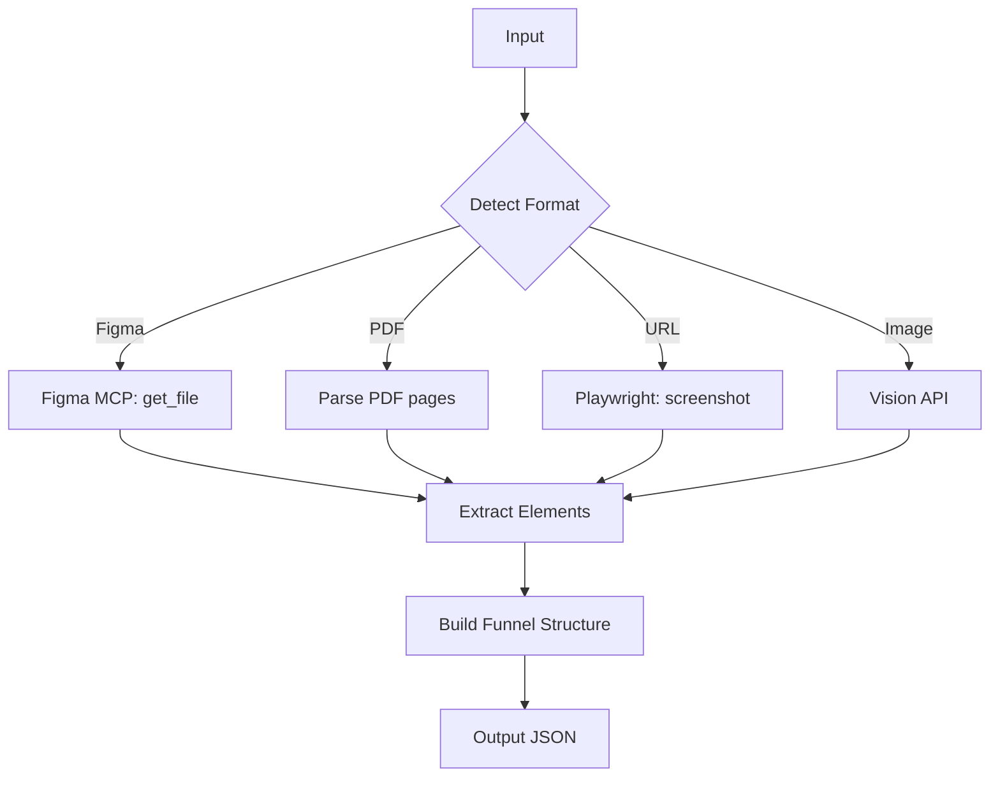

# Agent 1: Design Analyzer

## Purpose
Extract and structure information from quiz funnel design mockups regardless of format.

## Supported Input Formats

| Format | Detection | Processing Method |
|--------|-----------|-------------------|
| **Figma URL** | `figma.com/file/` or `figma.com/design/` | Figma MCP API |
| **PDF file** | `.pdf` extension | pdf-parse + Vision |
| **Web URL** | `http://` or `https://` | Playwright screenshot + Vision |
| **Image files** | `.png`, `.jpg`, `.jpeg`, `.webp` | Direct Vision analysis |

## Workflow



## Extraction Targets

1. **Screen Identification**
   - Welcome/intro screens
   - Question screens (with options)
   - Result/outcome screens
   - Offer/CTA screens

2. **Visual Elements**
   - Headlines and subheadlines
   - CTA button text and styling
   - Images, icons, illustrations
   - Progress indicators

3. **Brand Assets**
   - Logo detection
   - Color palette extraction
   - Typography identification

4. **Flow Mapping**
   - Screen sequence
   - Branching logic (if visible)
   - Question-to-result mapping

## Output Schema
See: [design_analysis.json](../shared/schemas/design_analysis.json)

## Usage

### From Figma
```
Input: https://www.figma.com/file/ABC123/Quiz-Funnel-Design
Output: ./outputs/analysis/design_[timestamp].json
```

### From PDF
```
Input: ./inputs/quiz-design.pdf
Output: ./outputs/analysis/design_[timestamp].json
```

### From URL
```
Input: https://example.com/quiz
Output: ./outputs/analysis/design_[timestamp].json
```

## MCP Tools Required
- `figma.get_file` - Retrieve Figma file structure
- `figma.get_images` - Export frames as images
- `playwright.screenshot` - Capture web pages
