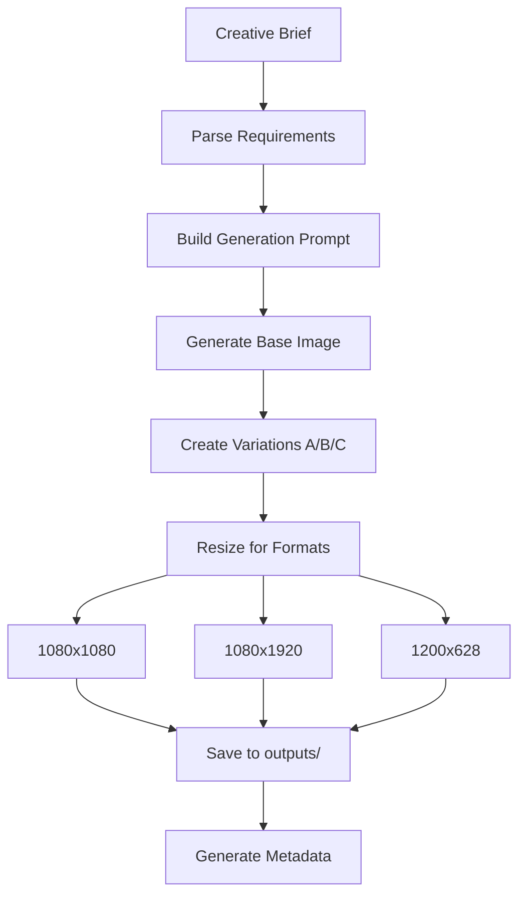

# Agent 5: Designer

## Purpose
Generate multiple creative variations based on briefs from Agent 4.

## Capabilities

| Output | Tool | Status |
|--------|------|--------|
| **Static Images** | generate_image / EverArt | ✅ Active |
| **Video Ads** | MiniMax MCP | 🔜 Planned |
| **Carousels** | Multi-image generation | 🔜 Planned |

## Workflow



## Prompt Engineering

### Base Prompt Template
```
Create a [STYLE] advertisement image:
- Visual concept: [FROM BRIEF]
- Color scheme: [FROM BRIEF]
- Typography: [FROM BRIEF]
- Mood: [professional/playful/urgent/etc]
- Format: [DIMENSIONS]

Include visual elements:
- [Element 1 from imagery list]
- [Element 2 from imagery list]

Text overlay:
- Headline: "[HOOK]"
- CTA: "[CTA TEXT]"

Style: Modern digital advertisement, clean composition, high contrast
```

### Style Modifiers
| Brief Style | Prompt Modifier |
|-------------|-----------------|
| minimalist | clean, white space, simple geometry |
| bold | high contrast, large text, vibrant colors |
| testimonial | photo with quote overlay, authentic feel |
| ugc | casual, phone-shot style, raw aesthetic |

## Output Structure

```
outputs/
└── creatives/
    └── brief_001/
        ├── variant_A/
        │   ├── 1080x1080.png
        │   ├── 1080x1920.png
        │   └── 1200x628.png
        ├── variant_B/
        │   └── ...
        ├── variant_C/
        │   └── ...
        └── metadata.json
```

## Metadata Format

```json
{
  "brief_id": "brief_001",
  "generated_at": "2024-01-15T10:30:00Z",
  "variants": [
    {
      "variant": "A",
      "prompt_used": "...",
      "files": [
        {"format": "1080x1080", "path": "variant_A/1080x1080.png"},
        {"format": "1080x1920", "path": "variant_A/1080x1920.png"}
      ]
    }
  ],
  "generation_tool": "generate_image",
  "model": "imagen"
}
```

## Format Specifications

| Platform | Format | Dimensions | Use Case |
|----------|--------|------------|----------|
| FB/IG Feed | Square | 1080x1080 | Primary |
| IG Stories | Vertical | 1080x1920 | Stories/Reels |
| FB Feed | Landscape | 1200x628 | Link ads |

## Quality Checklist

Before finalizing each creative:
- [ ] Text is readable at mobile size
- [ ] Brand colors applied correctly
- [ ] CTA is prominent and clear
- [ ] No text truncation in any format
- [ ] Visual hierarchy guides eye to CTA

## MCP Tools

### EverArt (Optional)
```json
{
  "server": "everart",
  "tools": [
    "everart.generate_image",
    "everart.upscale"
  ]
}
```

### Built-in
- `generate_image` - Antigravity native tool
