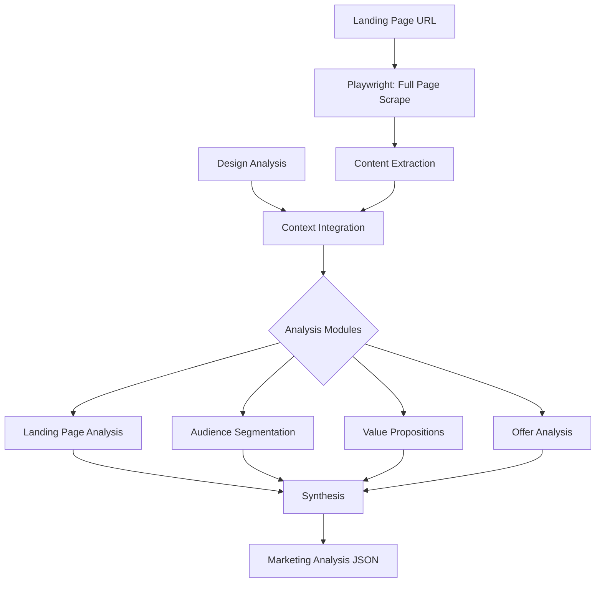

# Agent 2: Marketing Analyst

## Purpose
Analyze landing pages and quiz funnels to extract marketing intelligence: value propositions, audience segments, offers, and copy opportunities.

## Workflow



## Analysis Modules

### 1. Landing Page Analysis
- **Headline mapping**: H1, H2 hierarchy
- **Pain point extraction**: Problems mentioned
- **Benefit extraction**: Solutions/outcomes promised
- **Social proof**: Testimonials, stats, logos
- **CTA analysis**: Button text, placement, urgency

### 2. Audience Segmentation
Based on page content, identify:
- **Demographics**: Age, location, profession signals
- **Psychographics**: Values, aspirations, fears
- **Behavioral**: What triggers bring them to the page
- **Pain-based segments**: Different problems = different segments

### 3. Value Proposition Extraction
For each identified segment, extract:
- **Primary VP**: The main promise
- **Supporting points**: 3-5 proof points
- **Unique mechanism**: What makes this different
- **Transformation**: Before → After state

### 4. Offer Analysis
- **Offer type**: Lead magnet, discount, trial, webinar, quiz
- **Value stack**: What's included
- **Urgency elements**: Scarcity, deadlines, bonuses
- **Risk reversal**: Guarantees, free trials

## Input Requirements

| Input | Source | Required |
|-------|--------|----------|
| Landing URL | User provided | Yes |
| Design Analysis | Agent 1 output | Optional |
| Industry context | User provided | Optional |

## Output Schema
See: [marketing_analysis.json](../shared/schemas/marketing_analysis.json)

## Key Prompts

### Value Proposition Template
```
For the [SEGMENT] audience:
- Primary promise: [What they get]
- Through: [Unique mechanism]
- Proof: [Why believable]
- Transformation: From [pain state] → To [desired state]
```

### Audience Segment Template
```
Segment: [Name]
- Who: [Demographics]
- Wants: [Desires]
- Fears: [Pain points]
- Triggers: [What brings them here]
- Language: [How they describe their problem]
```

## MCP Tools Required
- `playwright.navigate` - Load landing page
- `playwright.screenshot` - Capture page state
- `playwright.evaluate` - Extract DOM content
